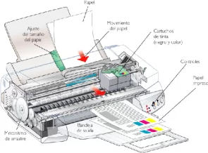
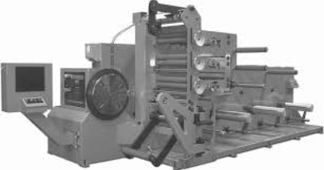
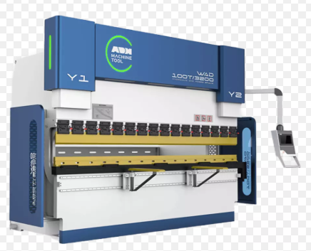
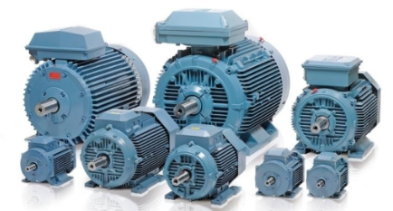
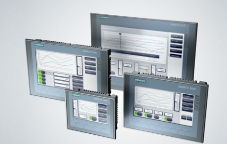
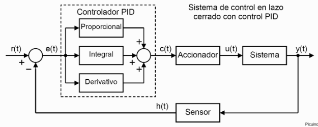
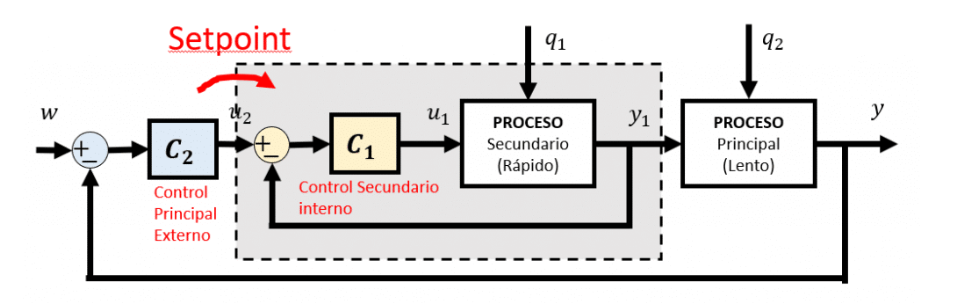

### Andrey Samir Romero Buitrago - 87382
### Miguel Ángel Rueda Santana - 73786

# Clase # 1

---

# Apuntes sobre Control de Movimiento

## ¿Qué es el Control de Movimiento?

El **control de movimiento**, también conocido como "robótica", se refiere al uso de sistemas para mover cargas de manera controlada en procesos industriales. ([Fuente](https://www.a-m-c.com/es/vista-general-del-control-de-movimiento/?utm_source=chatgpt.com))

## Aplicaciones del Control de Movimiento

El control de movimiento se utiliza en una variedad de aplicaciones industriales, incluyendo:

- **Impresoras**: Para posicionar con precisión el cabezal de impresión y el papel. (ver Figura 1)
- **Cortadoras**: Para dirigir herramientas de corte en trayectorias específicas. 
- **Máquinas dobladoras**: Para controlar el ángulo y la posición en operaciones de doblado de materiales. 

## Tipos de Movimientos en el Control de Movimiento

- **Movimiento Lineal**: Desplazamiento en línea recta.
- **Movimiento Rotacional**: Giro alrededor de un eje.
- **Movimiento Combinado**: Integración de movimientos lineales y rotacionales para lograr trayectorias complejas.

## Ejemplo: Impresoras

En las impresoras, el control de movimiento es esencial para:

- **Posicionamiento del Cabezal de Impresión**: Mover el cabezal a lo largo del papel con precisión.
- **Alimentación del Papel**: Controlar el avance del papel para asegurar una impresión uniforme.

## Evolución del Control de Movimiento

### Antes del Control de Movimiento Moderno

- **Uso de Motores Grandes**: Se empleaban motores de gran tamaño para accionar múltiples mecanismos.
- **Engranajes y Transmisiones Mecánicas**: Complejos sistemas de engranajes transmitían el movimiento desde un único motor a diferentes partes de la máquina.

### Mejoras con el Control de Movimiento

- **Precisión Incrementada**: Los sistemas modernos permiten un control más exacto de posiciones y velocidades.
- **Reducción de Tamaño y Complejidad**: Se utilizan motores más pequeños y sistemas electrónicos, disminuyendo la necesidad de engranajes voluminosos.
- **Flexibilidad Operativa**: Es más sencillo reprogramar y adaptar máquinas para diferentes tareas sin modificaciones mecánicas extensas.

   

Figura 1. Diagrama de una impresora mostrando los componentes controlados por sistemas de movimiento. ([Fuente](https://quecartucho.es/blog/partes-de-una-impresora/))

  
  
Figura 2. Imagen comparativa entre una máquina antigua con múltiples engranajes y una moderna con control de movimiento avanzado (CNC).([Fuente1](https://download.e-bookshelf.de/download/0003/9488/62/L-G-0003948862-0008296858.pdf))([Fuente2](https://aeromaquinados.com/product/dobladoras-de-lamina-cnc-80t-2500/))

Estas figuras ayudarán a visualizar los conceptos y la evolución en el control de movimiento dentro de diversas aplicaciones industriales.

## Conceptos Claves en el Control de Movimiento

## ¿Qué es un Actuador (Motor)?

Un **actuador** es un dispositivo que convierte energía en movimiento. En el contexto del control de movimiento, el actuador más común es el **motor**, que puede ser:

Figura 3. actuadores.([Fuente](https://funciondelaindustria.wordpress.com/2017/05/10/los-motores-electricos-y-su-importancia-en-la-industria/))

## ¿Qué es un HMI?

Un **HMI (Human-Machine Interface)** es una interfaz que permite a los operadores comunicarse con un sistema de control de movimiento. Puede incluir:

- **Pantallas táctiles** con información en tiempo real.
- **Botones físicos y diales** para control manual.
- **Software SCADA** para supervisión y análisis de datos.

El HMI facilita la configuración, monitoreo y ajuste de parámetros en sistemas automatizados.

Figura 4. HMI (Human-Machine Interface).([Fuente](https://grupo-syz.com/todos-los-productos/automatizacion/inferfaz-hombre-maquina-hmi/))

## Problemas Comunes en el Control de Movimiento

El control de movimiento puede enfrentar diversos problemas, entre ellos:

### 1. **Errores de Posicionamiento**
   - Causados por imprecisiones en sensores o desajustes mecánicos.
   - Se pueden corregir con sistemas de retroalimentación como encoders.

### 2. **Vibraciones y Resonancias**
   - Ocurren cuando el sistema mecánico no está bien amortiguado.
   - Se solucionan con ajuste de parámetros PID o uso de materiales adecuados.

### 3. **Sobrecalentamiento de Motores**
   - Puede deberse a un dimensionamiento incorrecto del motor.
   - Se mitiga con ventilación, disipadores de calor o selección de motores más eficientes.

### 4. **Fallas en la Comunicación**
   - Conexiones inadecuadas o interferencias pueden causar pérdida de datos.
   - Se previenen con cableado de calidad y protocolos de comunicación robustos.

### 5. **Fallas en la Fuente de Alimentación**
   - Un suministro inestable puede afectar el rendimiento del sistema.
   - Uso de reguladores de voltaje y fuentes de alimentación adecuadas minimizan este problema.

## Otras Aplicaciones del Control de Movimiento

Además de las impresoras, cortadoras y máquinas dobladoras, el control de movimiento se encuentra en:

| Aplicación                 | Descripción                                                                 |
|----------------------------|-----------------------------------------------------------------------------|
| **Robótica Industrial**    | Control preciso de brazos robóticos en líneas de ensamblaje.               |
| **Vehículos Autónomos**    | Sistemas de navegación en drones y robots móviles.                         |
| **Máquinas CNC**          | Fresado y torneado controlado por computadora.                              |
| **Impresión 3D**          | Movimiento preciso de extrusores para crear objetos en capas.               |
| **Ascensores**            | Regulación de la velocidad y posicionamiento de cabinas.                    |
| **Sistemas de Embalaje**  | Movimiento sincronizado de productos en líneas de producción.               |

Tabla 1. Aplicaciones del Control de Movimiento

El control de movimiento es fundamental en la automatización moderna, optimizando precisión, velocidad y eficiencia en múltiples industrias.

## Ejercicios sobre Control de Movimiento

### Ejercicio 1: Cálculo de Velocidad en un Sistema de Control de Movimiento

Un motor mueve una cinta transportadora con una velocidad angular de $$\omega = 10 $$ rad/s. Si el radio del tambor que impulsa la cinta es de r = 0.15 m, determina la velocidad lineal de la cinta.

**Fórmula utilizada:**

$$
v = \omega \cdot r
$$

**Sustituyendo los valores:**

$$
v = (10 \text{ rad/s}) \cdot (0.15 \text{ m})
$$

$$
v = 1.5 \text{ m/s}
$$

**Respuesta:** La velocidad lineal de la cinta es **1.5 m/s**.

---

### Ejercicio 2: Cálculo de Torque en un Motor

Un servomotor aplica una fuerza de F = 50N en el extremo de un brazo de palanca de r = 0.2 m. Calcula el torque generado por el motor.

**Fórmula utilizada:**

$$
\tau = F \cdot r
$$

**Sustituyendo los valores:**

$$
\tau = (50 \text{ N}) \cdot (0.2 \text{ m})
$$

$$
\tau = 10 \text{ Nm}
$$

**Respuesta:** El torque generado por el motor es **10 Nm**.

### Ejercicio 3: Aceleración Angular en un Motor

Un motor eléctrico parte del reposo y alcanza una velocidad angular de $$\omega_f = 50$$ rad/s en un tiempo de  t = 5 s. Determina la aceleración angular necesaria para lograr este cambio de velocidad.

**Fórmula utilizada:**

$$
\alpha = \frac{\omega_f - \omega_0}{t}
$$

**Sustituyendo los valores:**

$$
\alpha = \frac{50 - 0}{5}
$$

$$
\alpha = 10 \text{ rad/s}^2
$$

**Respuesta:** La aceleración angular del motor es **10 rad/s²**.

---

### Ejercicio 4: Fuerza Necesaria para Acelerar un Carro con Control de Movimiento

Un sistema de control de movimiento en una línea de ensamblaje impulsa un carro de m = 200 kg con una aceleración de a = 2.5 m/s². Determina la fuerza que debe aplicar el sistema.

**Fórmula utilizada:**

$$
F = m \cdot a
$$

**Sustituyendo los valores:**

$$
F = (200 \text{ kg}) \cdot (2.5 \text{ m/s}^2)
$$

$$
F = 500 \text{ N}
$$

**Respuesta:** La fuerza necesaria para acelerar el carro es **500 N**.

## Conclusión

A lo largo de estos apuntes, aprendimos sobre el **control de movimiento** y su importancia en la automatización. Descubrimos cómo los motores, actuadores y HMI permiten un control preciso en diversas aplicaciones industriales, como impresoras, cortadoras y máquinas CNC. Entendimos cómo ha evolucionado este campo, pasando de sistemas mecánicos con grandes motores y engranajes a soluciones más eficientes y flexibles.  

Además, resolvimos ejercicios que nos ayudaron a aplicar conceptos clave, como el cálculo de velocidad, torque, aceleración angular y fuerza. Gracias a esto, ahora tenemos una mejor comprensión de cómo funciona el control de movimiento en la industria y cómo se pueden optimizar los sistemas para mejorar su desempeño.

---

# Clase #2

### Control Cascada
El control cascada es una técnica utilizada en sistemas de control para mejorar la estabilidad y precisión del control. En este método, se utilizan múltiples lazos de control, donde el error de un lazo se utiliza como entrada para otro lazo.

#### Definición
*Control Cascada*: Es un sistema de control que utiliza múltiples lazos de retroalimentación para mejorar la precisión y estabilidad del sistema. Cada lazo se encarga de controlar una variable específica, y el error de un lazo se utiliza como referencia para el siguiente.

#### Ejemplo: Control de Velocidad en un Motor Eléctrico
En este ejemplo, el motor tiene un sensor que mide la velocidad actual y envía esta información al controlador. El controlador compara la velocidad actual con el punto de consigna (velocidad deseada) y ajusta la corriente eléctrica para mantener la velocidad dentro del rango deseado.

Figura 5. Diagrama control PID.([Fuente](https://www.picuino.com/es/control-pid.html))

1. **Sensor de Velocidad:**: Mide la velocidad actual del motor.
2. **Controlador**: Compara la velocidad actual con el punto de consigna y ajusta la corriente eléctrica.
3. **Elemento Final de Control**:En este caso, un controlador de corriente que ajusta la corriente eléctrica al motor.

**Limitaciones del Control Directo**  
Aunque el control directo es simple y efectivo para muchos procesos, puede tener limitaciones en términos de precisión y estabilidad, especialmente cuando se enfrenta a perturbaciones externas.

---

### Mejora con Control Cascada
En el ejemplo del motor eléctrico, podríamos agregar un segundo lazo que controle la corriente eléctrica que llega al motor. Este lazo actúa como un lazo interno que ajusta la corriente para asegurar que la potencia entregada sea precisa.

#### Esquema con Control Cascada
- **Lazo Externo**: Controla la velocidad del motor comparando la velocidad actual con el punto de consigna.
- **Lazo Interno**: Controla la corriente eléctrica para asegurar que la potencia entregada al motor sea precisa.

Figura 6. Diagrama control Cascada.  ([Fuente](https://controlautomaticoeducacion.com/control-realimentado/control-en-cascada/))

El lazo secundario actúa más rápido que el primario, compensando perturbaciones antes de que afecten la velocidad final.

**Diagrama del control en cascada:**
- Entrada de referencia → Controlador PID primario (velocidad) → Controlador PID secundario (corriente) → Motor DC → Salida

### **Ventajas del Control en Cascada**
- Mayor **precisión y estabilidad** en la regulación de la variable principal.
- Respuesta más **rápida a perturbaciones** internas y externas.
- Reducción de efectos de **retardos y variaciones en la carga**.

---

### Ecuaciones Básicas para Control de Velocidad
Para entender cómo funciona el control de velocidad, podemos considerar la ecuación básica del torque en un motor eléctrico:

   $$T = k_t × I$$

   
Donde:
- T* es el torque del motor.
- *k_t* es el coeficiente de torque.
- *I* es la corriente eléctrica.

---

## Tipos de Control en Cascada

| Tipo de Control en Cascada | Descripción |
|---------------------------|-------------|
| **Con lazo de corriente** | Se usa en motores eléctricos, donde el lazo primario controla la velocidad y el secundario la corriente. |
| **Con lazo de temperatura** | Usado en procesos térmicos, donde el lazo primario controla la temperatura y el secundario el flujo de calor. |
| **Con lazo de presión** | Aplicado en sistemas hidráulicos, donde el lazo primario regula la presión y el secundario el caudal de fluido. |

Tabla 2. Tipos de Control en Cascada

## Métodos de Sintonización en Control en Cascada

Para un buen desempeño del control en cascada, es crucial sintonizar correctamente los lazos de control. Existen varios métodos:

1. **Método Ziegler-Nichols:**  
   - Se usa para ajustar controladores PID con base en la respuesta al escalón del sistema.
   - Se determina la ganancia crítica ($$K_c$$) y el período de oscilación ($$T_u$$) para calcular los parámetros del PID.

2. **Método de la Respuesta en Frecuencia:**  
   - Se analizan las respuestas en frecuencia para encontrar los valores óptimos de control.

3. **Método de Prueba y Error:**  
   - Se ajustan los parámetros del controlador iterativamente hasta lograr un buen desempeño.

4. **Sintonización en Dos Etapas:**  
   - Primero se ajusta el lazo secundario para que responda rápidamente.
   - Luego se ajusta el lazo primario con base en el comportamiento del lazo secundario.

# **Sintonización del Control en Cascada para un Motor DC**

## **Fórmulas de Sintonización**

En un sistema de **control en cascada** para un **motor DC**, se deben sintonizar dos lazos:

- **Lazo secundario (corriente):** Controla la corriente del motor para mejorar la respuesta del sistema.  
- **Lazo primario (velocidad):** Controla la velocidad del motor utilizando la salida del lazo secundario.

La sintonización se realiza siguiendo estos pasos:

### **1. Sintonización del lazo de corriente**
Se usa un **controlador proporcional-integral (PI)** para garantizar una respuesta rápida sin afectar la estabilidad.

- **Ganancia proporcional del lazo de corriente:**

 $$K_{p_i}=\frac{L}{R}$$
 

- **Tiempo integral del lazo de corriente:**

  $$T_{i_i} = \frac{L}{R}$$

### **2. Sintonización del lazo de velocidad**
Se usa un **controlador PID** para regular la velocidad en función de la corriente.

- **Ganancia proporcional del lazo de velocidad:**

  $$K_{p_v} = \frac{1}{K_m \cdot K_{p_i}}$$

- **Tiempo integral del lazo de velocidad:**

  $$T_{i_v} = \frac{J}{K_m \cdot K_{p_i}}$$

- **Tiempo derivativo del lazo de velocidad:**

  $$T_{d_v} = \frac{J}{K_m \cdot K_{p_i} \cdot K_{p_v}}$$

Donde:
- $L$ = inductancia del motor.  
- $R$ = resistencia del motor.  
- $K_m$ = constante de torque del motor.  
- $J$ = inercia del rotor.  
- $K_{p_i}$ = ganancia del lazo de corriente.  
- $K_{p_v}$ = ganancia del lazo de velocidad.  
- $T_{i_i}$, $T_{i_v}$, $T_{d_v}$ = tiempos de integración y derivación.

---

## **Problema de Aplicación**

### **Enunciado**
Un motor DC de parámetros conocidos tiene los siguientes valores:

- Resistencia: $R = 1.2\, \Omega$
- Inductancia: $L = 0.5$ H
- Constante de torque: $K_m = 0.05$ Nm/A
- Inercia del rotor: $J = 0.01$ kg·m²

Se requiere sintonizar los lazos de **corriente y velocidad** en un **control en cascada**.

### **Solución Paso a Paso**

1. **Cálculo de los parámetros del lazo de corriente:**

   - **Ganancia proporcional del lazo de corriente:**

     $$K_{p_i} = \frac{L}{R} = \frac{0.5}{1.2} = 0.4167$$

   - **Tiempo integral del lazo de corriente:**

     $$T_{i_i} = \frac{L}{R} = \frac{0.5}{1.2} = 0.4167 \text{ s}$$

2. **Cálculo de los parámetros del lazo de velocidad:**

   - **Ganancia proporcional del lazo de velocidad:**

     $$K_{p_v} = \frac{1}{K_m \cdot K_{p_i}} = \frac{1}{0.05 \times 0.4167} = 48$$

   - **Tiempo integral del lazo de velocidad:**

     $$T_{i_v} = \frac{J}{K_m \cdot K_{p_i}} = \frac{0.01}{0.05 \times 0.4167} = 0.48 \text{ s}$$

   - **Tiempo derivativo del lazo de velocidad:**

     $$T_{d_v} = \frac{J}{K_m \cdot K_{p_i} \cdot K_{p_v}} = \frac{0.01}{0.05 \times 0.4167 \times 48} = 0.01 \text{ s}$$

---

# **Conclusión**

En esta clase aprendimos sobre el **control cascada**, sistemas de control donde se emplean múltiples lazos de realimentación para mejorar la estabilidad y el desempeño del sistema. Comparado con el **control PID directo**, el control en cascada permite una mejor compensación de perturbaciones y un ajuste más preciso del sistema.

Concluimos que un **control en cascada** se compone de dos lazos principales:  
- **Lazo primario (externo):** Controla la variable principal del sistema, como la velocidad o la posición.  
- **Lazo secundario (interno):** Regula una variable intermedia, como la corriente o el torque del motor, permitiendo una respuesta más rápida y estable.

También analizamos un ejemplo práctico: **el control de un motor DC**, donde comparamos un **control PID simple** con un **control en cascada** que incluye un lazo interno de corriente y un lazo externo de velocidad. Descubrimos que con el lazo adicional se mejora el tiempo de respuesta y se reduce el impacto de perturbaciones externas.

Además, estudiamos diferentes **métodos de sintonización** para ajustar los parámetros del controlador, lo que nos permitió entender cómo optimizar el desempeño del sistema.

En general, comprendimos que el control en cascada es una estrategia poderosa en **sistemas industriales y automatización**, utilizada en motores, sistemas térmicos, procesos químicos, entre otros. Al aplicar este enfoque, logramos un mayor control y estabilidad en comparación con un sistema de control convencional.

## Clase #3

---

# **Servomotores**

## **Definición**
Un **servomotor** es un tipo de motor diseñado para proporcionar un control preciso de su posición, velocidad y par. Funciona mediante un sistema de realimentación, lo que permite ajustar su movimiento de manera precisa en respuesta a las señales de control. Se utilizan en aplicaciones que requieren movimientos exactos, como robótica, sistemas de automatización, maquinaria CNC y control de aeronaves. Los servomotores pueden funcionar con corriente continua (DC) o corriente alterna (AC), dependiendo de la aplicación y las necesidades de control.

---

## **Variables a Controlar en un Servomotor**
Los servomotores requieren la regulación de diversas variables para garantizar su correcto funcionamiento y precisión en el movimiento. Las principales variables a controlar son:

- **Posición:** Es el ángulo o la distancia a la que se encuentra el eje del servomotor con respecto a su punto de referencia. Se mide en grados o radianes y es fundamental en aplicaciones como la robótica y el control de actuadores.

- **Velocidad:** Se refiere a la rapidez con la que cambia la posición del servomotor en un tiempo determinado. Se expresa en revoluciones por minuto (RPM) o en radianes por segundo. El control de velocidad es esencial en aplicaciones industriales donde se requiere un movimiento suave y preciso.

- **Torque (Par Motor):** Es la fuerza rotacional generada por el motor, necesaria para mover una carga específica. Un servomotor debe poder proporcionar el torque suficiente sin sobrecargar el sistema eléctrico o mecánico.

- **Corriente Eléctrica:** Es la cantidad de electricidad que fluye a través del motor y está relacionada con el torque que puede generar. Un control adecuado de la corriente permite mejorar la eficiencia y evitar sobrecalentamientos.

- **Voltaje de Alimentación:** Es la tensión eléctrica suministrada al servomotor. Diferentes tipos de servomotores requieren distintos voltajes para operar, y una variación en la alimentación puede afectar su rendimiento.

---

## **Componentes del Servomotor**
El funcionamiento de un servomotor depende de varios componentes que trabajan en conjunto para proporcionar un movimiento preciso. Estos componentes principales son:

### **1. Sección de Comando**
La sección de comando es la encargada de recibir y procesar las señales de entrada que determinan el comportamiento del servomotor. Estas señales pueden provenir de controladores como microcontroladores, PLCs o computadoras industriales. Dependiendo del tipo de servomotor, las señales de comando pueden ser señales analógicas, digitales o de modulación por ancho de pulso (PWM). La calidad y precisión de la señal de comando influyen directamente en la respuesta del motor.

### **2. Sección de Controlador**
El controlador es la parte encargada de interpretar la señal de comando y ajustar la alimentación del motor para generar el movimiento deseado. Este control puede implementarse mediante algoritmos como PID (Proporcional-Integral-Derivativo), que permiten regular la posición, velocidad y torque de manera óptima. Además, el controlador gestiona la realimentación del sistema, comparando la posición real con la posición deseada y aplicando las correcciones necesarias.

### **3. Sección del Motor**
El motor es el componente que convierte la energía eléctrica en movimiento mecánico. Dependiendo del tipo de aplicación, los servomotores pueden emplear motores de corriente continua (DC) o de corriente alterna (AC). La selección del motor adecuado depende de factores como la precisión requerida, la potencia, la velocidad y la eficiencia del sistema.

---

## **Tipos de Motores Utilizados en Servomotores**
Los servomotores pueden emplear distintos tipos de motores según las necesidades del sistema. Los más utilizados son:

### **1. Motores de Corriente Continua (DC)**
Los motores de corriente continua son ampliamente utilizados en servomecanismos debido a su capacidad de respuesta rápida y su facilidad de control. Estos motores funcionan con una alimentación directa y pueden ser controlados mediante señales de voltaje o corriente. Son comunes en aplicaciones de robótica, automatización industrial y sistemas de posicionamiento. Existen dos tipos principales:

- **Motores DC con Escobillas:** Utilizan un conjunto de escobillas y un conmutador para cambiar la polaridad del rotor. Son económicos y fáciles de controlar, pero requieren mantenimiento periódico debido al desgaste de las escobillas.

- **Motores DC sin Escobillas (Brushless):** No poseen escobillas, lo que reduce el desgaste mecánico y mejora la eficiencia y la vida útil del motor. Se controlan electrónicamente mediante señales de conmutación.

### **2. Motores de Corriente Alterna (AC)**
Los motores de corriente alterna se utilizan en aplicaciones donde se requiere mayor potencia y eficiencia energética. Son más robustos y requieren menos mantenimiento en comparación con los motores de corriente continua. Se dividen en dos categorías principales:

#### **Motores Síncronos**
Los motores síncronos son aquellos cuya velocidad de giro está sincronizada con la frecuencia de la corriente de alimentación. Son ideales para aplicaciones donde se necesita un control preciso de la velocidad y la posición, como en maquinaria industrial, generadores y sistemas de propulsión eléctrica.

#### **Motores Asíncronos (de Inducción)**
Los motores asíncronos, también conocidos como motores de inducción, son los más utilizados en la industria debido a su bajo costo y su funcionamiento confiable. En estos motores, la velocidad del rotor es ligeramente menor que la velocidad del campo magnético del estator. Se emplean en sistemas de bombeo, ventiladores, compresores y otras aplicaciones de alto rendimiento.

---

# **Motor de Corriente Continua (DC)**

## **Partes del Motor DC**
Un **motor de corriente continua (DC)** está compuesto por varios elementos esenciales que permiten su funcionamiento eficiente y preciso. Sus principales partes son:

### **1. Estator**
Es la parte fija del motor y su función es proporcionar un campo magnético estable. Puede estar compuesto por **imanes permanentes** en motores pequeños o por **devanados de campo** en motores más grandes.

### **2. Rotor o Inducido**
Es la parte giratoria del motor y contiene los devanados a través de los cuales fluye la corriente. El rotor gira cuando interactúa con el campo magnético generado por el estator.

### **3. Conmutador**
Es un anillo segmentado que cambia la dirección de la corriente en el inducido, permitiendo que el motor gire continuamente en una misma dirección. Se encuentra conectado al eje del rotor.

### **4. Escobillas**
Son contactos de carbono o grafito que presionan contra el conmutador para suministrar la corriente eléctrica al rotor. Con el tiempo, estas escobillas se desgastan y requieren reemplazo.

### **5. Bobinas del Inducido**
Son los devanados de cobre colocados en el rotor. Su función es generar un campo magnético cuando la corriente fluye a través de ellos, lo que provoca el movimiento del motor.

### **6. Eje**
Es el componente mecánico que transmite el movimiento del rotor hacia la carga externa que se desea accionar.

### **7. Carcasa**
Es la estructura que protege los componentes internos del motor y ayuda a disipar el calor generado durante su funcionamiento.

---

## **Aplicaciones del Motor DC**
Los motores de corriente continua se utilizan en una gran variedad de aplicaciones debido a su facilidad de control y capacidad para operar en sistemas que requieren velocidad y torque ajustables. Algunas aplicaciones comunes incluyen:

### **1. Robótica**
Los motores DC se emplean en robots para controlar movimientos precisos de brazos, ruedas y actuadores.

### **2. Vehículos Eléctricos**
Los motores DC impulsan motocicletas eléctricas, bicicletas eléctricas y algunos modelos de automóviles eléctricos pequeños.

### **3. Sistemas de Automatización Industrial**
Se utilizan en **bandas transportadoras, máquinas CNC y sistemas de ensamblaje** que requieren velocidad y torque ajustables.

### **4. Electrodomésticos**
Aparecen en dispositivos como **batidoras, licuadoras, aspiradoras y taladros eléctricos** donde se necesita un control preciso de velocidad y potencia.

### **5. Sistemas de Energía Renovable**
Se emplean en **generadores eólicos y paneles solares con seguimiento automático**, optimizando la captura de energía.

### **6. Juguetes y Modelismo**
Los motores DC se encuentran en **autos de control remoto, trenes eléctricos y drones**, proporcionando la energía necesaria para su movimiento.

### **7. Equipos Médicos**
Se utilizan en **bombas de infusión, sillas de ruedas eléctricas y dispositivos de asistencia** debido a su precisión y fiabilidad.

---

# **Motores de Corriente Alterna (AC)**  

---

## **Motores Síncronos**  

### **Partes del Motor Síncrono**  
1. **Estator:** Contiene los devanados trifásicos que generan un campo magnético giratorio cuando se alimentan con corriente alterna.  
2. **Rotor:** Puede ser un imán permanente o un devanado excitado con corriente continua.  
3. **Anillos Rozantes y Escobillas:** Se utilizan en motores con rotor devanado para suministrar la corriente de excitación.  
4. **Carcasa y Ventilación:** Protege los componentes internos y disipa el calor generado.  

### **Aplicaciones del Motor Síncrono**  
- Generadores eléctricos en plantas de energía.  
- Sistemas de transmisión y distribución de electricidad.  
- Compresores y bombas de gran capacidad.  
- Equipos de precisión como relojes eléctricos e instrumentos científicos.  

---

## **Motores Asíncronos (de Inducción)**  

### **Partes del Motor Asíncrono**  
1. **Estator:** Contiene los devanados trifásicos donde se genera el campo magnético giratorio.  
2. **Rotor en Cortocircuito o Rotor Bobinado:** Puede ser de jaula de ardilla o devanado trifásico, dependiendo del tipo de motor.  
3. **Ventilador y Carcasa:** Mantienen el motor refrigerado y protegido de contaminantes externos.  

### **Tipos de Motores Asíncronos**  
- **Motor de Inducción de Jaula de Ardilla:** Es el más común debido a su bajo costo y mantenimiento reducido.  
- **Motor de Inducción de Rotor Bobinado:** Se usa en aplicaciones que requieren control de velocidad mediante resistencias externas.  

### **Aplicaciones del Motor Asíncrono**  
- Bombas, ventiladores y compresores industriales.  
- Ascensores y escaleras mecánicas.  
- Máquinas herramientas y equipos de manufactura.  
- Electrodomésticos como lavadoras y aires acondicionados.  

---

| **Tipo de Motor**       | **Ventajas** | **Desventajas** |
|------------------------|-------------|---------------|
| **Motor de Corriente Continua (DC)** | - Fácil control de velocidad y torque.    - Alta respuesta dinámica.    - Ideal para aplicaciones de precisión. | - Mayor mantenimiento por escobillas y conmutador.    - Menor eficiencia en comparación con motores AC.    - Vida útil reducida en modelos con escobillas. |
| **Motor AC Síncrono** | - Velocidad constante sin importar la carga.    - Alta eficiencia en cargas constantes.    - Útil en aplicaciones de potencia y precisión. | - Requiere un sistema de excitación para el rotor.    - Arranque complicado sin un controlador adicional.    - Costoso en comparación con otros motores. |
| **Motor AC Asíncrono (Inducción)** | - Bajo mantenimiento y alta durabilidad.    - Menor costo de fabricación.    - Muy utilizado en la industria. | - Peor control de velocidad comparado con los motores DC y síncronos.    - Eficiencia menor en cargas variables.    - Deslizamiento entre el campo magnético y el rotor. |

Tabla 3. ventajas y desventajas de los tipos de motores.
---

# **Zonas de Operación del Motor**

Los motores eléctricos tienen diferentes **zonas de operación** dependiendo de las condiciones de carga, velocidad y alimentación. Estas zonas determinan el comportamiento del motor y su rendimiento.

## **1. Corto Tiempo Estando Detenido**
Cuando el motor está detenido y se le aplica una tensión de alimentación, genera un **torque de arranque** que depende del diseño del motor. En esta fase:
- La corriente de arranque es muy alta, generalmente **5 a 7 veces** la corriente nominal.
- El torque inicial es mayor en **motores de inducción** y controlado en **motores DC**.
- Se deben emplear técnicas de arranque como **arranque suave** o **variadores de frecuencia**.

## **2. Velocidad Nominal**
Es la velocidad de operación para la cual el motor ha sido diseñado. En esta zona:
- El motor trabaja con **máxima eficiencia**.
- Se logra un equilibrio entre el **torque mecánico** y la **carga aplicada**.
- Se mantiene una **relación estable entre corriente y potencia**.

## **3. Variando la Frecuencia**
Cuando se varía la frecuencia de alimentación en **motores AC**, se puede modificar la velocidad del motor. Algunas consideraciones:
- En **motores de inducción**, la velocidad está dada por:
  
  $$N_s = \frac{120 f}{P}$$

  Donde:
  - $\( N_s \)$ = velocidad síncrona (RPM)
  - $\( f \)$ = frecuencia de alimentación (Hz)
  - $\( P \)$ = número de polos del motor

- Se utilizan **variadores de frecuencia (VFD)** para modificar la velocidad de manera eficiente.

---

# **Curvas de Velocidad-Torque del Motor**

Las **curvas de velocidad-torque** muestran el comportamiento del motor en diferentes condiciones de carga. Existen tres tipos principales:

1. **Motor de Corriente Continua (DC)**
   - El torque es **inversamente proporcional** a la velocidad.
   - La relación está dada por:

     $$T = \frac{K}{N}$$

2. **Motor Asíncrono (Inducción)**
   - Presenta **deslizamiento** entre la velocidad del rotor y la velocidad síncrona.
   - La curva tiene una pendiente pronunciada cerca de la velocidad nominal.

3. **Motor Síncrono**
   - No tiene deslizamiento, por lo que la velocidad es constante independientemente de la carga.
   - Su curva de torque es **plana** en la velocidad nominal.

---

# **Modelo por Corriente de Armadura**

El **modelo matemático** de un motor DC se divide en **tres partes**:

## **Modelo por Corriente de Armadura**

El **modelo matemático** de un motor DC se divide en **tres partes**:

### **1. Parte Eléctrica**  
$$\[
v_a = L_a \dot{I_a} + R_a I_a + V_b
$$\]

### **2. Parte Magnética**  
$$\[
T_m = (K_a K_c I_c) I_a(t) = K_I I_a(t)
$$\]

$$\[
V_b = K_e \omega
$$\]

$$\[
T_m = T_c + T_p
$$\]

### **3. Parte Mecánica**  
$$\[
J\frac{d^2\theta}{dt^2} + b \frac{d\theta}{dt} + k\theta = \tau (t)
\]$$

---

# **Conclusión**
Aprendimos que los motores operan en **diferentes zonas de trabajo**, dependiendo de la carga y velocidad.  
- La **curva de velocidad-torque** es clave para entender su desempeño.  
- El **modelo por corriente de armadura** permite analizar el comportamiento eléctrico, magnético y mecánico.  
- La variación de frecuencia en **motores AC** es una estrategia eficiente para el control de velocidad.

Este conocimiento es fundamental para el **diseño y control de sistemas eléctricos** en aplicaciones industriales y de automatización.

